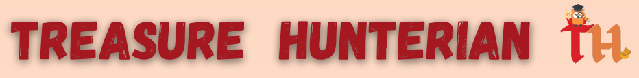
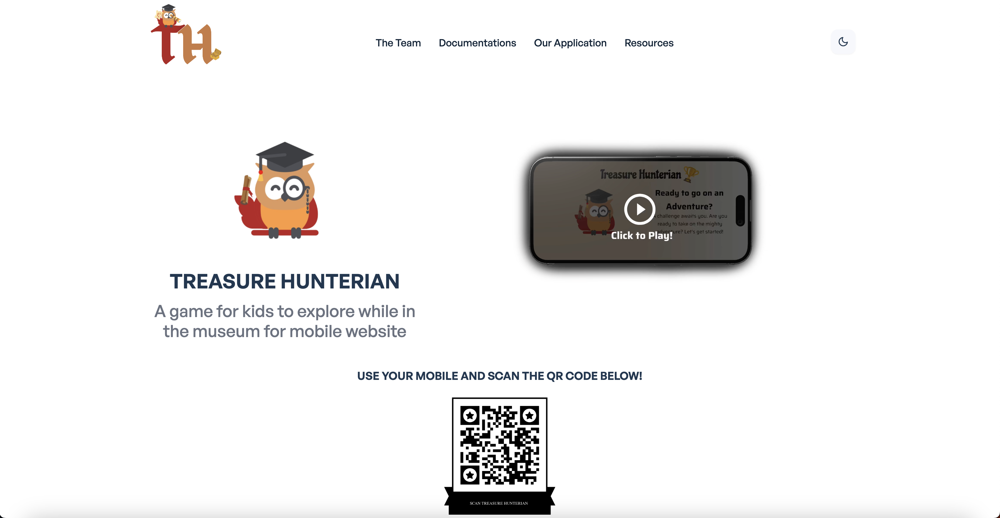

  <h2 align="center">SIT-UoG Computing Science</h2>
   
  <h3 align="center">(2022-23) OIP Team 3B presents:</h3>

   
  
  

<h3>Marvellous discoveries and adventures await you in The Hunterian Museum!</h3>

  

# About The Project

This is a web portfolio built using React and Tailwind aiming to showcase the journey made by team. Highlights of the journey include Requirement Gathering, Ideation, Wireframing and more.

The website is currently hosted on https://design-and-innovation-2023.github.io/TreasureHunterian/.

 

 

## Built With
ReactJS
Tailwind CSS

 

 

### Running the Project
1. Download the repo (as zip or clone).
2. Run the command npm install
3. Run the command npm start

 

## Contact

Jun Xiang - [GitHub](https://github.com/xiaopang254) - [LinkedIn](https://www.linkedin.com/in/laujunxiang/) 
Xin Jie - [GitHub](https://github.com/XJ-UoG) - [LinkedIn](https://www.linkedin.com/in/xin-jie-tan-66505b148/) 
Shyam - [GitHub](https://github.com/shyxxm) - [LinkedIn](https://www.linkedin.com/in/shyam-prasad) 
Ayan - [GitHub](https://github.com/csgnwinter) - [LinkedIn](www.linkedin.com/in/ayan-priyadarshi-52621757/) 
Ivan - [GitHub](https://github.com/shingliya) - [LinkedIn](https://www.linkedin.com/in/leongwengyanivan/) 
Jeff - [GitHub](https://github.com/miscting) - [LinkedIn](https://www.linkedin.com/in/jeffleejh/) 
